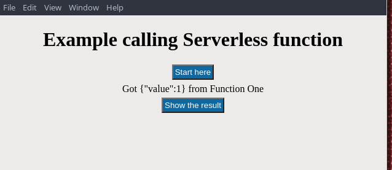
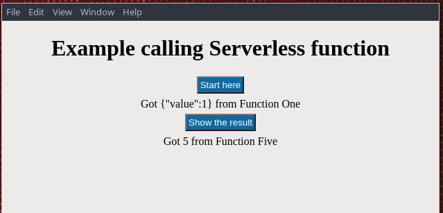

# desktop-electron

A basic electron application created to call Knative functions.

> OTEL-JS packages in use:

| Package | |
| ----------- | ----------- |
| @opentelemetry/exporter-trace-otlp-http | To export to OTEL collector OTLP/HTTP |
| @opentelemetry/resources | To be used with `semantic-conventions` to identify the application/service's name |
| @opentelemetry/sdk-trace-web | For automatic instrumentation |
| @opentelemetry/semantic-conventions | To be used with `resources` to identify the application/service's name |
| @opentelemetry/instrumentation | To register the fetch auto-instrumentation plugin |
| @opentelemetry/instrumentation-fetch | For fetch auto-instrumentation |

## How to run

1. Open a terminal

2. Clone the Function-Five repository:

```shell
git clone https://github.com/obs-nebula/function-five.git
```

3. Install the `func` binary https://knative.dev/docs/functions/install-func/

4. Follow the run instructions https://github.com/obs-nebula/function-five#run

5. Open other terminal and run this example

```shell
git clone https://github.com/obs-nebula/desktop-electron.git
cd desktop-electron
npm install
npm run build
npm start
```

You will see this majestic desktop layout:


When you click on the `Start here` button you will get the following result:



And if you click on `Show the result` button you will get the result of the last operation done by the `Function Five`:



